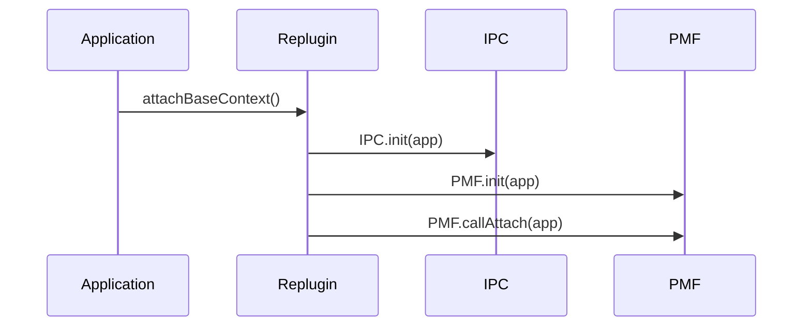
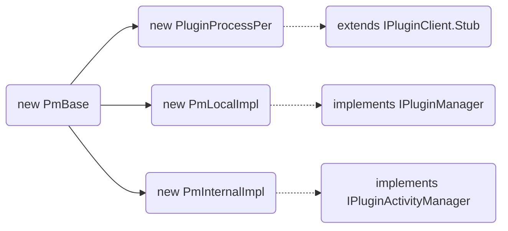

### 常用语法
#### 箭头
```java
sequenceDiagram
    Alice->>John: Hello John, how are you?
    John-->>Alice: Great!
```
#### 使用别名
```java
sequenceDiagram
    participant A as Alice
    participant J as John
    A->>J: Hello John, how are you?
    J->>A: Great!
```
#### 使用标注
```java
sequenceDiagram
    participant John
    Note right of John: Text in note

sequenceDiagram
    Alice->John: Hello John, how are you?
    Note over Alice,John: A typical interaction
```
### 时序图实例

### 流程图实例

### markdown支持的流程图
```flow
st=>start: PmBase.init
e=>end: end
cond=>condition: persistent进程?
op1=>operation: initForClient
op2=>operation: initForPersistent
op3=>operation: PluginTable.initPlugins
st->cond
cond(yes)->op2->op3
cond(no)->op1->op3
```
### 绘制uml图
```plantuml
class A  {
{static}String data
int time
method1()
{abstract}method2()
}
interface I {
void doSomething()
}
class C {
}
A <|-- C
I <|.. C
```
### 参考链接
[官方文档](https://mermaidjs.github.io/sequenceDiagram.html)

